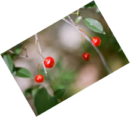
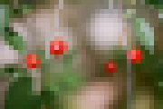
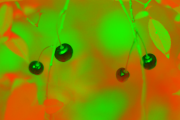
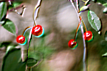

### 2DImage

- draw_text 文字生成图片工具
```
  -colorB float
        内容RGB (default 255)
  -colorG float
        内容RGB (default 255)
  -colorR float
        内容RGB (default 255)
  -height int
        图片高度 (default 1000)
  -pngSavePath string
        文件保存path (default "out.png")
  -text string
        文本内容 (default "文本内容\n第二行")
  -textFontSize int
        字体大小 (default 100)
  -width int
        图片宽度 (default 1000)

```

- draw_circle 画圆工具
```
  -colorB float
        背景RGB (default 255)
  -colorG float
        背景RGB (default 255)
  -colorR float
        背景RGB (default 255)
  -height int
        图片高度 (default 1000)
  -pngSavePath string
        文件保存path (default "out.png")
  -radius float
        原型半径 (default 400)
  -width int
        图片宽度 (default 1000)
```

- draw_line 画直线
```
  -colorB float
        内容RGB (default 255)
  -colorG float
        内容RGB (default 255)
  -colorR float
        内容RGB (default 255)
  -height int
        图片高度 (default 1000)
  -lineWidth float
        线宽 (default 5)
  -pngSavePath string
        文件保存path (default "out.png")
  -width int
        图片宽度 (default 1000)
  -x1 float
        直线起点x (default 100)
  -x2 float
        直线终点x (default 900)
  -y1 float
        直线起点y (default 100)
  -y2 float
        直线终点y (default 900)
```

- draw_star 画五角星
```
  -colorB float
        内容RGB (default 255)
  -colorG float
        内容RGB (default 255)
  -colorR float
        内容RGB (default 255)
  -height int
        图片高度 (default 1000)
  -lineWidth float
        线宽 (default 5)
  -pngSavePath string
        文件保存path (default "out.png")
  -radius float
        原型半径 (default 400)
  -width int
        图片宽度 (default 1000)
  -x1 float
        五角心中心x (default 500)
  -y1 float
        五角心中心y (default 500)

```

- image_handle
```
  -pngFiler string
        过滤器 (default "resize")
  -pngSavePath string
        文件保存path (default "out.png")
  -srcPngPath string
        原图path
```

pngFiler:

 name / result                              | name / result                              | name / result                              | name / result
--------------------------------------------|--------------------------------------------|--------------------------------------------|--------------------------------------------
resize                                      | crop_to_size                               | rotate_180                                 | rotate_30
                |          |            | 
brightness_increase                         | brightness_decrease                        | contrast_increase                          | contrast_decrease
   |   |     | 
saturation_increase                         | saturation_decrease                        | gamma_1.5                                  | gamma_0.5
   |   |             | 
gaussian_blur                               | unsharp_mask                               | sigmoid                                    | pixelate
         |          |               | 
colorize                                    | grayscale                                  | sepia                                      | invert
              |             |                 | 
mean                                        | median                                     | minimum                                    | maximum
                  |                |               | 
hue_rotate                                  | color_balance                              | color_func                                 | convolution_emboss
            |         |            | 
